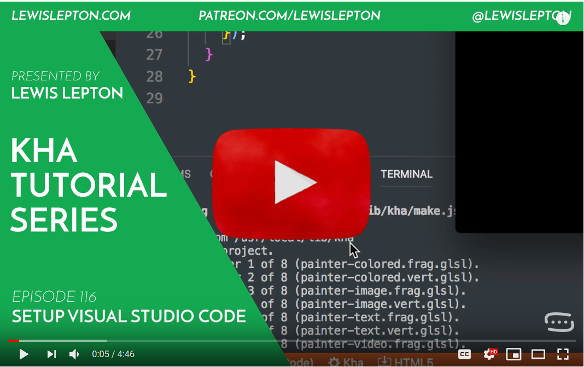
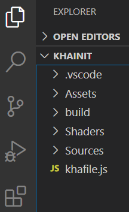
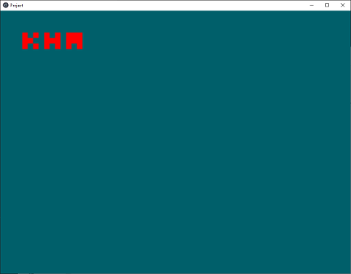
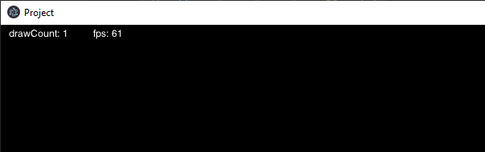

## Installing IDE + Kha
The first thing we need to do is to install visual studio

You can do the first part of the installation using Lewis Lepton video on how to install kha and visual studio code, plus how to setup kha's git version. Then jump to the "Add Khawy" section of the tutorial

[](https://www.youtube.com/watch?v=50IUtcZyyGk)

### Setting up Visual Studio Code
[Visual Studio Code](https://code.visualstudio.com) can be used by installing the [Kha Extension Pack](https://marketplace.visualstudio.com/items?itemName=kodetech.kha-extension-pack)

### Init a kha project
Now we want to create a kha project. To do this inside visual studio code, we open the folder were we want to init ower project. Then we press F1 to open the Command Palette and type inside "Kha: Init Project". If everything went alright you should see in your explorer tab a bunch of new folders and files.



If we now press F5 (Run->Start Debugging) and everithing went ok during installation, we should see a new window open.



## Add Khawy
### Add khawy to khafile.js
Clone [Khawy](https://github.com/juakob/khawy) into the folder you init your kha project.
Open your khafile.js and add this lines
```js
let project = new Project('New Project');
project.addAssets('Assets/**');
project.addShaders('Shaders/**');
project.addSources('Sources');
project.addDefine('debugInfo'); //add Fps and draw count <<<======
await project.addProject('khawy'); //import khawy <<<==============
resolve(project);
```

### Init khawy
Now lets create an initial state, to do that we will create a folder under Source with the name states.
Inside that folder we will create a new file "MyState.hx", and we will add this code to define the class and its inheritance
```js
package states;

import com.framework.utils.State;

class MyState extends State {
    
}
```

And we will replace the code in Main.hx to 
```js
package;

import kha.System;
import com.framework.Simulation;
import states.MyState;

class Main {

	public static function main() {
		System.start({title: "Project", width: 1280, height: 720}, function (_) {		
			new Simulation(MyState,1280,720,1,0);
		});
	}
}
```

Now if we run again the debug (F5) we should see a black window with the draw count and framerate at the top left of ower screen



Congratulation!! Now we are ready to start coding games

